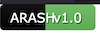
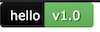

# Go Badge

[](https://github.com/hatamiarash7/gobadge/actions/workflows/test.yml)

GoBadge is an open source project for displaying information via SVG "badges". GoBadge was inspired by the open source project, **[shields.io](https://shields.io)**.

## Getting Started

```bash
go get github.com/hatamiarash7/gobadge
```

```go
package main

import (
    "github.com/hatamiarash7/gobadge"
)

var HttpHandler = func(writer http.ResponseWriter, r *http.Request) {
    label := r.URL.Query().Get("label")
    tag := r.URL.Query().Get("tag")
    color := r.URL.Query().Get("color")

    writer.Header().Set("Content-Type", "image/svg+xml")
    writer.Header().Set("Cache-Control", "no-store, no-cache, must-revalidate, post-check=0, pre-check=0")

    canvas := svg.New(writer)
    view := dash.View{
        Canvas: canvas,
        Badge: dash.Badge{
            Label: label,
            Tag:   tag,
            Color: color,
        },
    }

    view.Draw()
}
```

## Example

Run server:

```bash
cd example && go run server.go
```

Then get your badge from `http://localhost:8080/example?label=hello&tag=world&color=green`

## Known problem

Currently, badge will not be rendered correctly with some letters in the label because of formula for dynamic width calculation.





The length of Capital letters is bigger than other ones. ( I will working on it )
